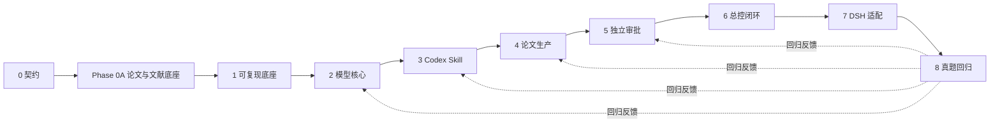

# CUMCM Workbench Implementation Plan

> **For agentic workers:** REQUIRED SUB-SKILL: Use superpowers:subagent-driven-development (recommended) or superpowers:executing-plans to implement this plan task-by-task. Steps use checkbox (`- [ ]`) syntax for tracking.

**Goal:** 按阶段 0–8 及不重编号的 Phase 0A 建设一套以 Codex 为主要入口、兼容 DeepSeek Harness、可追溯并具备独立论文审批能力的国赛数学建模工作台。

**Architecture:** 开发仓库以 `shared/` 为唯一事实来源，`toolkit/` 提供 Python 确定性能力，`adapters/` 分别提供 Codex 与 DSH 适配。每个阶段先固定契约和验证，再让后续工具、Skill 与论文流程依赖该稳定接口。

**Tech Stack:** Windows、Python 3.11、uv、pytest、Pydantic/JSON Schema、NumPy、pandas、SciPy、scikit-learn、statsmodels、Matplotlib、XeLaTeX、latexmk、Git、Codex Skills、DeepSeek Harness/Cordis 插件。

**Spec:** `docs/superpowers/specs/2026-08-21-cumcm-workbench-design.md`

## Global Constraints

- 主要运行环境是 Codex 桌面环境和本地 Windows 工作区；DeepSeek Harness 是兼容运行时。
- Python 版本固定为 3.11；依赖由 uv 锁定，正式结果不得只存在于 Notebook。
- 论文主生产线固定为 XeLaTeX 与最终 PDF；首期不建设 Word 主生产线。
- `shared/` 是开发时唯一事实来源；Codex 与 DSH 安装包只能由构建过程复制共享资产。
- Windows 环境下不得依赖符号链接维持双端一致性。
- 任何论文数值必须来自真实数据和真实运行结果；缺少证据时必须停止。
- 总控流程保留问题拆解、主模型、论文提纲和最终提交四个人工确认门。
- 论文生成与审批必须隔离；审批 Skill 不直接修改论文。
- 年度规则按年份、来源和核验日期维护；内部量表不得冒充官方评分权重。
- 每道赛题使用独立工作区；比赛临时修改不得直接污染共享核心。
- 每个阶段的详细计划只有在上一阶段验收通过后才定稿，以已验证接口为依据。
- 仓库已经初始化；阶段 0 以九项契约建立历史基线，Phase 0A 追加 `literature-source` 与 `citation-link` 后将当前目录扩展为 11 项，并已完成论文与文献路线整合。

---

## Program structure

本项目保留阶段 0–8 的编号，并在阶段 0 后加入不重编号的 Phase 0A。主计划只规定依赖、文件面和验收门；可直接执行的逐步任务写入对应阶段计划。

| 阶段 | 子计划文件 | 依赖 | 独立交付物 |
| --- | --- | --- | --- |
| 0 规范与契约 | `docs/superpowers/plans/2026-08-21-cumcm-workbench-phase-0-contracts.md` | 已批准总体设计 | 可验证的 Schema、样例、目录与变更规范 |
| Phase 0A 论文与文献整合底座 | `docs/superpowers/plans/2026-08-21-paper-research-integration-foundation.md` | 阶段 0 | `literature-source`、`citation-link` 与受控路由文档 |
| 1 可复现底座 | `docs/superpowers/plans/2026-08-21-cumcm-workbench-phase-1-foundation.md` | Phase 0A | 环境诊断、项目骨架、实验记录和最小 PDF |
| 2 高频模型核心 | `docs/superpowers/plans/2026-08-21-cumcm-workbench-phase-2-model-core.md` | 阶段 1 | 数据审计、统一模型运行、基线和敏感性能力 |
| 3 Codex 建模 Skill | `docs/superpowers/plans/2026-08-21-cumcm-workbench-phase-3-codex-skills.md` | 阶段 2 | 可追溯建模半链路 |
| 4 论文生产线 | `docs/superpowers/plans/2026-08-21-cumcm-workbench-phase-4-paper-pipeline.md` | 阶段 3 | 证据约束的 LaTeX 论文与 PDF |
| 5 独立审批 | `docs/superpowers/plans/2026-08-21-cumcm-workbench-phase-5-review-gates.md` | 阶段 4 | 五层审批报告和修订闭环 |
| 6 总控闭环 | `docs/superpowers/plans/2026-08-21-cumcm-workbench-phase-6-orchestrator.md` | 阶段 5 | 四个人工门与可恢复状态机 |
| 7 DSH 适配 | `docs/superpowers/plans/2026-08-21-cumcm-workbench-phase-7-dsh-adapter.md` | 阶段 6 | DSH Skill、工具插件和真实组合测试 |
| 8 真题回归 | `docs/superpowers/plans/2026-08-21-cumcm-workbench-phase-8-regression.md` | 阶段 7 | 三类代表场景与历年真题回归报告 |

Program-level tracking:

- [x] 阶段 0：九项基础契约的测试和只读验证器通过，完成向 Phase 0A 的历史交接。
- [x] Phase 0A：论文与文献契约及路由文档通过，批准进入阶段 1 规划。
- [x] 阶段 1：新环境诊断、标准工作区和最小 PDF 通过，完成向阶段 2 的历史交接。
- [x] 阶段 2：评价、预测、优化代表场景通过，完成向阶段 3 的历史交接。
- [x] 阶段 3：六个 Codex 建模 Skill、真实产物交接与资源一致性通过。
- [x] 阶段 4：证据约束论文、引用、LaTeX 与 PDF 检查通过并合入主线。
- [x] 阶段 5：五层审批、85/70 评分、修订失效、15 项契约和 12 个 Skill 通过。
- [x] 阶段 6：四个人工门、失败恢复、磁盘检查点和完整 Codex 流程通过，批准进入阶段 7 规划。
- [x] 阶段 7：DSH 真实组合与双端一致性通过，批准进入阶段 8 规划。
- [ ] 阶段 8：三类完整回归和人工复核通过，批准受控扩展模型范围。

## File ownership map

| 路径 | 单一责任 | 允许修改者 |
| --- | --- | --- |
| `shared/contracts/` | JSON Schema、契约目录和版本规则 | 阶段 0 及经迁移审核的后续任务 |
| `shared/knowledge/` | 基础知识、题型导航和模型卡 | 阶段 2 与知识维护流程 |
| `shared/rules/` | 按年份管理的竞赛规则和来源 | 规则更新流程 |
| `shared/templates/` | LaTeX、项目配置和报告模板 | 阶段 1、4 与模板回归流程 |
| `shared/rubrics/` | 复现、模型、论文和提交量表 | 阶段 5 与量表审核流程 |
| `shared/fixtures/` | 合成数据、黄金结构和代表场景 | 对应阶段测试任务 |
| `toolkit/src/cumcm_toolkit/` | 确定性 Python 工具 | 阶段 1、2、4、5 |
| `adapters/codex/skills/` | Codex Skill 和打包资源声明 | 阶段 3–6 |
| `adapters/dsh/` | DSH Skill、插件、preset 和配置 | 阶段 7 |
| `tests/` | 跨组件契约、快照、集成和端到端测试 | 各阶段测试任务 |
| `docs/` | 架构、操作、维护、审批和实施文档 | 对应阶段文档任务 |
| `scripts/` | 安装、验证、打包和回归入口 | 对应工具任务 |
| `dist/` | 自动生成的安装产物 | 构建脚本；禁止手改 |
| `workspaces/` | 单次比赛输入、实验和论文 | 比赛流程；不进入共享资产发布包 |

## Dependency flow



## Phase 0: Contracts and governance

**Objective:** 建立所有后续组件共同依赖的目录、Schema、样例、版本和变更门禁。

**Primary files:**

- `.gitignore`
- `.python-version`
- `pyproject.toml`
- `shared/contracts/*.schema.json`
- `shared/fixtures/contracts/{valid,invalid}/*.json`
- `scripts/validate_contracts.py`
- `tests/contracts/test_contract_examples.py`
- `docs/architecture/contracts.md`
- `docs/quality/acceptance-gates.md`
- `docs/operations/change-policy.md`

**Execution plan:** `docs/superpowers/plans/2026-08-21-cumcm-workbench-phase-0-contracts.md`

**Verification:**

```powershell
uv sync --dev
uv run pytest tests/contracts -v
uv run python scripts/validate_contracts.py
```

**Exit criteria:**

- 所有 Schema 通过 Draft 2020-12 元校验。
- 每个 Schema 至少有一个有效样例和一个明确失败的无效样例。
- 工具错误、人工门状态、实验记录和证据链均有显式契约版本。
- 资产清单能够发现重复 ID、缺失文件和哈希不一致。
- 文档说明破坏性契约变更的迁移与回归要求。

## Phase 0A: Paper and literature integration foundation

**Objective:** 在不创建运行时 Skill、检索 CLI 或 DSH 插件的前提下，固定论文与文献的共享契约、受控候选到人工批准路线，以及后续阶段的单一职责边界。

**Primary files:**

- `shared/contracts/literature-source.schema.json`
- `shared/contracts/citation-link.schema.json`
- `shared/fixtures/contracts/{valid,invalid}/literature-*.json`
- `shared/fixtures/contracts/{valid,invalid}/citation-link*.json`
- `shared/contracts/catalog.json`
- `docs/architecture/contracts.md`
- `docs/architecture/paper-skill-capability-matrix.md`
- `docs/guides/paper-and-literature-workflow.md`
- `tests/contracts/test_paper_integration_documentation.py`

**Execution plan:** `docs/superpowers/plans/2026-08-21-paper-research-integration-foundation.md`

**Verified inputs:** 阶段 0 的严格契约语义和当前 11 项契约目录；2026-08-21 的静态观察为三个个人 Skill 文件夹均存在、`paper-search` CLI 当前不可用、`cumcm_*` 运行时工具在所检会话中不可用或未确认。Task 1 的可复用盘点脚本已按用户指示跳过，Phase 0A 不依赖该脚本或盘点命令。

**Exit criteria:**

- `literature-source` 和 `citation-link` 具有正负样例并保持严格失败语义。
- `cumcm-orchestrator` 明确为未来默认入口，`literature-researcher` 为按需子 Skill；两者均不得写成当前已安装能力。
- `cumcm-paper` 与 `math-modeling-paper` 仅作为用户显式选择的 legacy 入口。
- 候选文献只有在人工门 3 随提纲批准后才能形成正式引用，不新增第五个全局人工门。
- Codex 为主要入口；DSH 通过后续打包消费同一 `shared/` 资产和契约。
- Phase 0A 不提前创建 Phase 3、4、6、7 的可执行文件。

## Phase 1: Reproducible foundation

**Objective:** 在全新 Windows 环境中诊断依赖、创建标准比赛工作区、记录实验并编译最小中文 PDF。

**Planned files:**

- `toolkit/src/cumcm_toolkit/environment/doctor.py`
- `toolkit/src/cumcm_toolkit/project/scaffold.py`
- `toolkit/src/cumcm_toolkit/experiments/manifest.py`
- `toolkit/src/cumcm_toolkit/artifacts/index.py`
- `shared/templates/project/`
- `shared/templates/latex/`
- `scripts/bootstrap.ps1`
- `scripts/check_environment.ps1`
- `tests/integration/test_fresh_workspace.py`
- `tests/integration/test_minimal_latex_build.py`
- `docs/operations/environment.md`
- `docs/operations/workspace-layout.md`

**Required detailed-plan inputs:** Phase 0A 的最终 Schema 与路由政策、实际探测到的 Python/uv/TeX 安装状态、选定的 MiKTeX 或 TeX Live 发行版。Phase 1 仅在 Phase 0A 验收完成后开始。

**Verification:**

```powershell
uv run pytest toolkit/tests/environment toolkit/tests/project toolkit/tests/experiments -v
uv run pytest tests/integration/test_fresh_workspace.py -v
uv run pytest tests/integration/test_minimal_latex_build.py -v
```

**Exit criteria:**

- 环境诊断对缺失依赖返回结构化失败，不误报“可用”。
- 项目骨架可重复创建，默认不覆盖已有文件。
- 相同输入、参数和随机种子生成一致的实验身份与关键结果。
- 最小 XeLaTeX 中文论文可编译，引用状态和页数可读取。

**Verified inputs (2026-08-22):** Python 3.11.9（`D:\Python311`）；uv 由 `scripts/bootstrap.ps1` 引导至 `.superpowers/bootstrap-uv`；TeX 为 MiKTeX 用户级安装，`xelatex` 在 PATH；`latexmk` 在 PATH 但依赖 Perl（本机未装，不可用），Phase 1 最小编译链路使用 `xelatex` 双遍直编；11 项契约不变；toolkit 通过 pytest `pythonpath` 导入，无新增依赖。

## Phase 2: High-frequency model core

**Objective:** 完成首批基础知识、模型卡、文献检索与引用基础知识，以及评价、预测、优化共用的数据与实验工具。

**Planned files:**

- `shared/knowledge/foundations/*.md`
- `shared/knowledge/model-cards/{data,evaluation,prediction,optimization,classification,statistics}/*.md`
- `shared/knowledge/model-catalog.yaml`
- `shared/knowledge/literature/search-strategy.md`
- `shared/knowledge/literature/deduplication.md`
- `shared/knowledge/literature/source-evaluation.md`
- `toolkit/src/cumcm_toolkit/data/profile.py`
- `toolkit/src/cumcm_toolkit/data/transform.py`
- `toolkit/src/cumcm_toolkit/models/registry.py`
- `toolkit/src/cumcm_toolkit/models/runner.py`
- `toolkit/src/cumcm_toolkit/evaluation/metrics.py`
- `toolkit/src/cumcm_toolkit/evaluation/baselines.py`
- `toolkit/src/cumcm_toolkit/evaluation/sensitivity.py`
- `toolkit/src/cumcm_toolkit/results/export.py`
- `tests/integration/test_evaluation_scenario.py`
- `tests/integration/test_prediction_scenario.py`
- `tests/integration/test_optimization_scenario.py`
- `tests/knowledge/test_literature_knowledge.py`

**Required detailed-plan inputs:** 阶段 1 的工作区与实验接口、Phase 0A 的文献契约和受控路由政策、首批模型优先级统计、每个代表场景的合成数据与预期指标。

**Verification:**

```powershell
uv run pytest toolkit/tests/data toolkit/tests/models toolkit/tests/evaluation -v
uv run pytest tests/knowledge/test_literature_knowledge.py -v
uv run pytest tests/integration/test_evaluation_scenario.py tests/integration/test_prediction_scenario.py tests/integration/test_optimization_scenario.py -v
```

**Exit criteria:**

- 每张模型卡通过结构检查，包含适用条件、假设、基线、检验和误用警示。
- 三类代表场景均可从数据审计运行到结果导出。
- 指标工具能识别至少一个数据泄漏或错误划分反例。
- 敏感性输出包含扰动参数、范围、结果变化和稳定性结论所需数据。
- 文献检索知识覆盖检索问题、中英文关键词、后端查询参数和候选用途，不把候选直接写成正式引用。
- 去重规则按 DOI、规范化标题和来源标识形成确定性候选组；元数据冲突必须保持候选状态并交由人工核验，不能静默合并。
- 来源评价规则区分元数据完整性、全文可用性、拟支持主张和支持边界；不得把引用量或期刊等级等同于来源质量或模型正确性。
- 合成知识测试覆盖重复 DOI、规范化标题重复、标识冲突和仅有引用量信号的反例。
- Phase 2 只交付共享知识与规则，不实现运行时 Skill；Codex `literature-researcher` 仍由 Phase 3 实现。

**Verified inputs (2026-08-22):** 依赖 numpy 2.4.6 / pandas 2.3.3 / scipy 1.17.1 / scikit-learn 1.9.0 / statsmodels 0.14.6 / matplotlib 3.x / PyYAML；`shared/knowledge/` 含 11 篇基础文档、33 张模型卡（model-card.schema.json + model-catalog.yaml）、文献知识三件套；`toolkit` 新增 data/models/evaluation/results 八模块；三类代表场景（评价熵权+TOPSIS、预测线性回归、优化 LP）从数据审计跑到结果导出；11 项契约不变。

## Phase 3: Codex modeling skills

**Objective:** 让 Codex 独立调用读题、数据审计、模型选择、求解、敏感性和按需文献研究 Skill，形成可追溯建模半链路与候选文献路由。

**Planned files:**

- `adapters/codex/skills/problem-reader/`
- `adapters/codex/skills/data-auditor/`
- `adapters/codex/skills/model-selector/`
- `adapters/codex/skills/solver/`
- `adapters/codex/skills/sensitivity-analyst/`
- `adapters/codex/skills/literature-researcher/`
- `scripts/package_codex_skills.py`
- `tests/snapshots/codex-skills/`
- `tests/e2e/test_codex_modeling_flow.py`
- `tests/e2e/test_literature_researcher_routing.py`

**Required detailed-plan inputs:** 阶段 2 的最终工具 CLI/API、模型目录、文献检索/去重/来源评价规则和结构化结果样例。

**Verification:**

```powershell
uv run python scripts/package_codex_skills.py --check
uv run pytest tests/snapshots/codex-skills tests/e2e/test_codex_modeling_flow.py tests/e2e/test_literature_researcher_routing.py -v
```

**Exit criteria:**

- 每个 Skill 的触发和不触发样例均通过。
- Skill 缺少数据或工具失败时停止，不生成替代数值。
- `literature-researcher` 通过触发、非触发、后端选择和无后端失败关闭测试；只输出候选文献，不批准引用。
- 端到端建模半链路生成问题清单、候选模型、实验记录、结果和敏感性产物。
- 打包后 Skill 自包含，且资源哈希与 `shared/` 一致。

**Verified inputs (2026-08-25):** Phase 3 交付 `problem-reader`、`data-auditor`、`model-selector`、`solver`、`sensitivity-analyst`、`literature-researcher` 六个独立建模 Skill；统一 complete/blocked 外壳现在核验实际输出文件、artifact/experiment/evidence-link 记录和哈希，不接受只满足格式的证据 ID。发行 catalog 共 7 个 Skill，第七个 `model-reviewer` 属 Phase 5。打包器采用 `references/<source path>` 布局、记录 SHA-256，并可用 `--check --output <dir>` 检测已生成目录漂移；最新验收数字以 Phase 3/5 交付报告和可重复验证命令为准，不再固化早期 15 项测试数字。

## Phase 4: Evidence-bound paper pipeline

**Objective:** 只使用固化结果、实验与引用证据链生成提纲、正文、摘要、BibTeX、LaTeX 与 PDF。

**Planned files:**

- `shared/templates/latex/cumcm/`
- `shared/knowledge/writing/*.md`
- `toolkit/src/cumcm_toolkit/latex/scaffold.py`
- `toolkit/src/cumcm_toolkit/latex/build.py`
- `toolkit/src/cumcm_toolkit/latex/lint.py`
- `toolkit/src/cumcm_toolkit/pdf/inspect.py`
- `toolkit/src/cumcm_toolkit/evidence/linker.py`
- `toolkit/src/cumcm_toolkit/evidence/citation_linker.py`
- `toolkit/src/cumcm_toolkit/latex/bibliography.py`
- `toolkit/src/cumcm_toolkit/latex/citation_check.py`
- `adapters/codex/skills/paper-outliner/`
- `adapters/codex/skills/paper-writer/`
- `adapters/codex/skills/latex-publisher/`
- `tests/e2e/test_paper_pipeline.py`

**Required detailed-plan inputs:** 阶段 3 的固化结果格式、证据 ID 和 Codex Skill 打包方式。

**Verification:**

```powershell
uv run pytest toolkit/tests/latex toolkit/tests/pdf toolkit/tests/evidence -v
uv run pytest tests/e2e/test_paper_pipeline.py -v
```

**Exit criteria:**

- 第三个人工门在论文正文生成前生效。
- 摘要中的每个关键数值都能解析到证据 ID。
- BibTeX/LaTeX 引用只能来自已批准的 `literature-source`，并由 `citation-check` 校验正文、参考文献、定位与 `citation-link` 一一对应。
- LaTeX 编译无阻断错误、未定义引用或缺失图片。
- PDF 页数、字体和空白页检查产生结构化报告。

**Verified inputs (2026-08-22):** `toolkit` 新增 latex/{scaffold,build,lint,bibliography,citation_check} 与 pdf/inspect、evidence/{linker,citation_linker} 八模块；`shared/templates/latex/cumcm/` CUMCM 模板；`shared/knowledge/writing/` 六篇写作知识；`tests/e2e/test_paper_pipeline.py` 证据绑定论文管线（build/lint/citation_check/inspect/resolve 全绿）；`evidence-link.schema.json` locator.kind 枚举向后兼容新增 `metric` 并登记新样例；11 项契约不变；pypdf 依赖入锁。`adapters/codex/skills/paper-{outliner,writer,latex-publisher}` 属 Codex 轨道，Phase 4 tracking 行待双轨道合拢后标记完成（本阶段不勾选）。

## Phase 5: Independent review gates

**Objective:** 建立硬性、复现、模型、论文和评委质询五层独立审批。

**Planned files:**

- `shared/rubrics/reproducibility.yaml`
- `shared/rubrics/model-quality.yaml`
- `shared/rubrics/paper-quality.yaml`
- `shared/rubrics/red-team.yaml`
- `shared/rubrics/submission.yaml`
- `toolkit/src/cumcm_toolkit/review/engine.py`
- `toolkit/src/cumcm_toolkit/review/severity.py`
- `adapters/codex/skills/model-reviewer/`
- `adapters/codex/skills/repro-reviewer/`
- `adapters/codex/skills/paper-reviewer/`
- `adapters/codex/skills/red-team-reviewer/`
- `adapters/codex/skills/submission-auditor/`
- `toolkit/src/cumcm_toolkit/review/bundle.py`
- `shared/contracts/review-bundle.schema.json`
- `tests/e2e/test_review_isolation.py`
- `tests/e2e/test_revision_requires_rereview.py`

**Required detailed-plan inputs:** 阶段 4 的最终论文、PDF、证据索引和结构化编译报告。

**Verification:**

```powershell
.venv\Scripts\python.exe -m pytest toolkit/tests/review -v -p no:cacheprovider
.venv\Scripts\python.exe -m pytest tests/e2e/test_five_gate_review_flow.py -v -p no:cacheprovider
```

**Exit criteria:**

- S0/S1 问题能够阻断通过状态。
- 审批报告的每个问题包含证据位置、严重度和修订建议。
- 审批过程不修改论文源文件。
- 论文修改后旧审批自动失效并要求重新运行。

## Phase 6: Orchestrated competition flow

**Status:** ✅ 完成（15 项合同、12 个 Codex Skill、四人工门、可选文献分支与恢复闭环均已实现）。

**Objective:** 将子 Skill、工具、四个人工门和状态恢复组合为完整 72 小时竞赛流程。

**Planned files:**

- `shared/workflows/cumcm-72h.yaml`
- `shared/workflows/stage-transitions.yaml`
- `adapters/codex/skills/cumcm-orchestrator/`
- `toolkit/src/cumcm_toolkit/workflow/state.py`
- `toolkit/src/cumcm_toolkit/workflow/gates.py`
- `tests/e2e/test_four_human_gates.py`
- `tests/e2e/test_optional_literature_branch.py`
- `tests/e2e/test_resume_after_failure.py`
- `docs/competition/72-hour-playbook.md`
- `docs/competition/recovery-playbook.md`

**Required detailed-plan inputs:** 阶段 3–5 的稳定 Skill 输入输出、审批状态和失败类型。

**Verification:**

```powershell
uv run pytest toolkit/tests/workflow -v
uv run pytest tests/e2e/test_four_human_gates.py tests/e2e/test_optional_literature_branch.py tests/e2e/test_resume_after_failure.py -v
```

**Exit criteria:**

- 未确认的人工门无法被总控跳过。
- `cumcm-orchestrator` 仅在需要外部证据时启动可选文献分支；候选清单在人工门 3 随提纲批准，不新增第五个全局人工门。
- 中断后能从最近固化阶段恢复，不重复覆盖有效产物。
- 子 Skill 失败时状态保持一致并给出明确恢复动作。
- 代表场景能从赛题运行到通过审批的 PDF。

## Phase 7: DeepSeek Harness adapter

**Status:** ✅ 完成（cumcm-tools 15 工具、literature-tools 3 工具、12 个 DSH Skill、preset cumcm-agent、双端资产哈希一致、真实组合 e2e 通过）。

**Objective:** 在不复制开发源的前提下，为 DSH 提供同名 Skill、含显式网络权限的确定性搜索/读取 Tool 插件和真实组合测试。

**Planned files:**

- `adapters/dsh/skills/`
- `adapters/dsh/plugins/cumcm-tools/`
- `adapters/dsh/plugins/literature-tools/`
- `adapters/dsh/presets/cumcm-agent/cordis.yml`
- `scripts/package_dsh_assets.py`
- `tests/contracts/test_codex_dsh_asset_parity.py`
- `tests/snapshots/dsh/`
- `tests/e2e/test_dsh_real_composition.py`

**Required detailed-plan inputs:** 阶段 6 的稳定工具接口、状态机、Skill 资源清单，以及目标 DSH 仓库和版本。

**Verification:**

```powershell
uv run python scripts/package_dsh_assets.py --check
uv run pytest tests/contracts/test_codex_dsh_asset_parity.py tests/e2e/test_dsh_real_composition.py -v
```

在 DSH 仓库中运行：

```powershell
pnpm run test
pnpm run test:coverage
pnpm run test:snapshot
pnpm run build
pnpm run hygiene
```

**Exit criteria:**

- DSH 通过 Tool 插件暴露稳定、校验严格的模型可调用能力。
- DSH 提供与 Codex 语义一致的 `literature-researcher`，搜索/读取使用确定性 Tool 插件；网络访问、允许域与凭据权限必须显式配置并失败关闭。
- `cordis.yml` 缺少必需配置时明确失败。
- 产品可见插件通过 Loader 真实组合测试。
- Codex 与 DSH 的共享资产哈希、契约版本和关键产物语义一致。

**Verified inputs (2026-08-26):** 阶段 6 交付的 `review-bundle`、`workflow-event`、`decision` 2.0 契约与磁盘工作流检查点已作为 DSH 侧稳定输入验证通过（orchestrator/review Skill 引用同一契约与 `cumcm_toolkit.workflow.*`/`review.*` 库）。双端资产哈希基线已固化：model-cards 33 个文件在 Codex 打包器与 DSH manifest 间哈希逐路径一致，契约 15 项（+catalog.json）覆盖与哈希一致，`package_dsh_assets --check` 102 项资产无漂移；`decision.schema.json` 为 v1/v2 双版本 oneOf 结构（v2 为 legacy 迁移分支），奇偶测试按 {"1.0","2.0"} 断言。真实组合 e2e 通过（5 项：plugin add + dump-config、Loader 注册 15 工具、真实工具调用与磁盘副作用、真实 xelatex 编译、失败关闭）。

## Phase 8: Regression and controlled expansion

**Objective:** 用合成场景和历年真题验证完整系统及引用相关性与来源 provenance，再依据实际缺陷扩展模型与 Skill。

**Planned files:**

- `shared/fixtures/scenarios/evaluation/`
- `shared/fixtures/scenarios/prediction/`
- `shared/fixtures/scenarios/optimization/`
- `shared/fixtures/historical/manifest.yaml`
- `shared/fixtures/historical/citation-provenance.yaml`
- `tests/e2e/test_full_evaluation_case.py`
- `tests/e2e/test_full_prediction_case.py`
- `tests/e2e/test_full_optimization_case.py`
- `tests/e2e/test_historical_citation_provenance.py`
- `docs/quality/regression-report-template.md`
- `docs/quality/model-expansion-policy.md`

**Required detailed-plan inputs:** 阶段 7 的双端完整流程、用户合法提供的历年赛题与数据、当年官方规则。

**Verification:**

```powershell
uv run pytest tests/e2e/test_full_evaluation_case.py tests/e2e/test_full_prediction_case.py tests/e2e/test_full_optimization_case.py tests/e2e/test_historical_citation_provenance.py -v
uv run python scripts/run_regression.py --suite representative
```

**Exit criteria:**

- 三类完整场景均通过工具、Skill、论文和审批门禁。
- 历年真题报告记录模型选择、失败点、审批分数和人工复核结论。
- 历史案例回归由人工复核文献相关性、主张支持边界与来源 provenance，并验证 Codex/DSH 的引用降级语义一致。
- 新模型只在真题频率或已观察缺陷证明需要时加入。
- 回归发现的问题映射到具体工具、知识、Skill 或量表，不以笼统改写代替根因修复。

## Program release gates

| 里程碑 | 必须通过的门禁 | 可交付能力 |
| --- | --- | --- |
| M0 契约与论文文献基线 | 阶段 0 与 Phase 0A 全部测试 | 后续组件可共享稳定 Schema 与受控引用路线 |
| M1 可复现底座 | 阶段 1 全部测试 | 可创建工作区并编译最小 PDF |
| M2 建模半链路 | 阶段 2–3 全部测试 | 可完成审计、选模、求解和敏感性 |
| M3 完整 Codex 流程 | 阶段 4–6 全部测试 | 可经四个人工门产出审批 PDF |
| M4 双端一致 | 阶段 7 全部测试 | Codex 与 DSH 使用同一能力核心 |
| M5 真题验证 | 阶段 8 全部测试 | 三类场景稳定，具备受控扩展条件 |

## Change and review protocol

- 每个详细阶段计划必须引用本主计划与总体设计。
- 每个任务遵循测试先行：先写失败测试，再实现最小行为，再运行相关门禁。
- 每个任务形成独立、可审查的提交，并使用非交互 Git 命令。
- 阶段门未通过时，不创建依赖其未稳定接口的下一阶段详细计划。
- 阶段验收由文件、命令输出、结构化报告和外部读取结果共同证明，不接受仅由 Skill 自述的“已通过”。
- 任何范围扩展先更新总体设计，再更新主计划和受影响的阶段计划。

## Plan completion criteria

本主计划完成不代表系统已经实现。只有 Phase 0A 以及阶段 0–8 的详细计划分别执行、验证并通过对应发布门，系统才达到总体设计中的完整验收标准。阶段 0、Phase 0A、阶段 1–7 已完成，当前目录登记 15 项契约、可打包 12 个 Codex Skill 与 12 个 DSH Skill、双端资产哈希一致；下一步是阶段 8 的真题回归。
