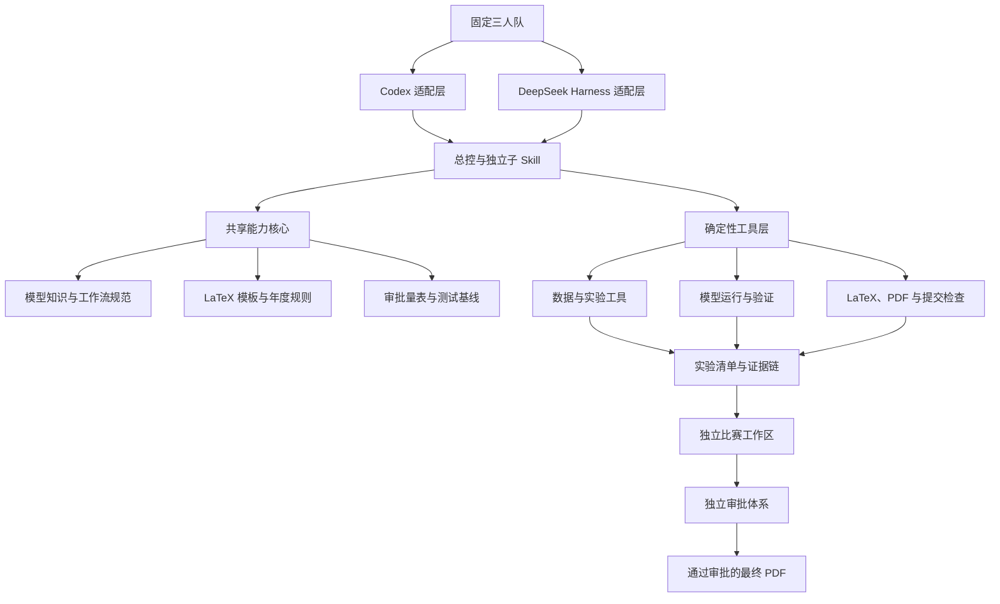
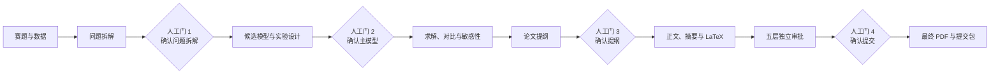

# 国赛数学建模工作台总体设计

面向固定三人队、以国奖质量为目标，建设一套以 Codex 为主要入口、同时适配 DeepSeek Harness 的可复现数学建模与 LaTeX 论文生产工作台。

| 属性 | 内容 |
| --- | --- |
| 文档状态 | 已完成需求确认，可用于后续实施规划 |
| 设计日期 | 2026-08-21 |
| 主要用户 | 数学建模基础起步的固定三人队 |
| 主要运行时 | Codex 桌面环境、本地 Windows 工作区 |
| 兼容运行时 | DeepSeek Harness |
| 核心论文格式 | LaTeX（XeLaTeX）与最终 PDF |
| 质量目标 | 国奖导向的内部质量标准，不承诺竞赛奖项 |
| 本文范围 | 总体架构、资产、工具、Skill、审批、测试、路线图与治理 |
| 本文不包含 | 具体代码、项目骨架、Skill 文件、插件包和模型知识正文 |

> 重要约束：任何论文数值必须来自真实数据和真实运行结果。系统不得在缺少证据时补写、猜测或伪造结论。

## 目标与边界

### 建设目标

1. 为基础起步团队提供够用的模型知识，而不是建设完整数学课程。
2. 把重复、易错且可确定执行的工作固化为工具。
3. 用总控 Skill 编排比赛流程，同时允许子 Skill 独立调用。
4. 建立从赛题、数据、代码、实验到论文结论的完整证据链。
5. 建立独立于论文生成过程的国奖导向审批体系。
6. 让 Codex 与 DeepSeek Harness 使用同一套知识、契约、模板和测试基线。
7. 支持按阶段建设，每个阶段均有可独立验证的交付物。

### 首期非目标

- 不建设完整模型百科或系统数学课程。
- 不建设 Word 主生产线；Word 仅作为未来兼容输出。
- 不建设网页管理后台、数据库、Docker 平台或完整 MLOps 系统。
- 不自研通用优化器、机器学习框架或 LaTeX 引擎。
- 不实现“一键从赛题直接生成最终论文”的无确认流程。
- 不自动伪造、搜索并插入参考文献。
- 不把自动查重或“AI 率”判断作为可靠质量门禁。
- 不把内部审批分值表述为官方评分细则。

## 已确认的设计决策

| 决策 | 结论 | 原因 |
| --- | --- | --- |
| 服务范围 | 优先服务本人和固定三人队 | 降低抽象与维护成本，优先形成实战价值 |
| 团队基础 | 基础起步 | 知识资料需解释选择依据和常见误区 |
| 建设重心 | 工具与 Skill 优先 | 基础模型只需达到会理解、会选择、会解释 |
| 运行时 | Codex 主用，兼容 DSH | 保留本地工作效率并支持后续 DSH 使用 |
| 论文格式 | LaTeX/XeLaTeX 主生产线 | 便于公式、引用、编译和自动检查 |
| Skill 形态 | 总控与独立子 Skill 混合 | 比赛时可编排，平时可单点学习和调试 |
| 自动化程度 | 四个人工确认门 | 在效率与关键决策控制之间取得平衡 |
| 首批模型 | 高频核心并用真题频率校正 | 先覆盖评价、预测、优化等高收益方向 |
| 质量目标 | 国奖导向 | 强化可复现、对比、敏感性、创新和质询 |
| 总体路线 | 共享核心、双端适配、分层建设 | 避免两端重复维护和插件过度工程化 |

## 设计原则

1. **单一事实来源**：知识、规则、模板、量表和契约在开发仓库中只维护一份。
2. **推理与确定性分离**：Skill 负责判断、推理、编排和写作；工具负责计算、编译、检查和结构化输出。
3. **证据优先**：论文结论必须连接到数据、代码、参数和运行记录。
4. **生成与审批隔离**：生成 Skill 不得修改审批量表；审批 Skill 不得直接暗改论文。
5. **逐级披露**：Skill 主文件保持精简，按题型读取对应模型卡、规则和模板。
6. **失败显式化**：文件缺失、计算失败、编译错误或结果不一致时停止并报告，不静默降级为猜测。
7. **比赛工作区隔离**：每道赛题独立保存数据、实验与论文，不污染共享核心。
8. **变更面驱动验证**：只运行覆盖当前变更面的最小充分测试，里程碑运行完整回归。

## 总体架构



### 组件职责

| 组件 | 职责 | 不承担的职责 |
| --- | --- | --- |
| 共享能力核心 | 保存知识、规则、模板、契约、量表和测试样例 | 不直接执行模型或编译论文 |
| Codex 适配层 | 为 Codex 提供 Skill、资源导航和工具调用约定 | 不复制维护共享知识 |
| DSH 适配层 | 提供同名工作流 Skill、工具插件和组合配置 | 不修改智能体主循环 |
| 确定性工具层 | 数据检查、模型运行、实验记录、编译和提交检查 | 不决定主模型，不评价创新性 |
| 总控 Skill | 判断阶段、检查产物、调用子 Skill、触发人工门 | 不亲自包办全部建模和写作 |
| 独立子 Skill | 完成单一阶段的推理或写作工作 | 不跨越未经确认的人工门 |
| 独立审批体系 | 基于固化产物和证据输出问题清单与等级 | 不直接修改被审论文 |
| 比赛工作区 | 保存单次比赛全部输入、运行记录与交付物 | 不承载公共知识和通用工具源码 |

## 标准工作流与人工确认门



人工门未确认时，总控 Skill 必须停留在当前阶段。确认记录需包含选择、理由、时间和对应产物版本。

## 标准产物与证据链

| 阶段 | 必备输入 | 核心输出 | 关键验证 |
| --- | --- | --- | --- |
| 题目理解 | 赛题原文、附件数据 | 问题清单、字段清单、约束和假设风险 | 原题逐问覆盖、数据文件真实存在 |
| 模型设计 | 问题清单、模型卡 | 候选模型、主模型、基线、实验设计 | 适用条件、替代模型和检验方案齐全 |
| 求解验证 | 已确认模型、清洗数据 | 代码、参数、结果、图表、敏感性报告 | 可重复运行，正文数值可追溯 |
| 论文生产 | 固化结果与证据链 | 提纲、正文、摘要、LaTeX、PDF | 不引入无来源数值，编译无阻断错误 |
| 独立审批 | 固化论文和运行证据 | 分层审批报告、问题等级、修订闭环 | 审批与生成隔离，问题有具体证据 |
| 最终提交 | 通过审批的 PDF 和附件 | 提交包、最终检查报告 | 年度规则、文件完整性和备份均通过 |

每次正式实验至少记录：输入文件哈希、代码版本、依赖版本、随机种子、参数、开始与结束时间、输出文件、关键指标和执行状态。证据链将论文结论关联到结果文件、实验记录和生成代码。

## 工具体系

### 基础环境

- Python 3.11 与 `uv`：统一环境并锁定依赖。
- JupyterLab：用于探索；正式结果必须由可重复运行的脚本产出。
- MiKTeX 或 TeX Live：提供 XeLaTeX、`latexmk` 和中文支持。
- Git：保存工具、文档、Skill、论文和决策版本。
- Codex：本地主要入口；DeepSeek Harness：兼容运行时。

具体发行版、字体和依赖版本须在实施阶段通过环境探测确定，本文不假设其已经安装。

### 确定性工具清单

| 工具 | 作用 | 首期优先级 |
| --- | --- | --- |
| `environment-doctor` | 检查 Python、LaTeX、字体和依赖 | 必需 |
| `project-scaffold` | 创建单次比赛标准工作区 | 必需 |
| `dependency-lock` | 锁定并记录运行依赖 | 必需 |
| `artifact-index` | 登记数据、代码、图表、论文和审批报告 | 必需 |
| `data-profile` | 检查字段、缺失、异常、重复、分布和相关性 | 必需 |
| `data-transform` | 执行可配置清洗并保存变换记录 | 必需 |
| `model-runner` | 通过统一接口运行指定模型 | 必需 |
| `baseline-compare` | 比较主模型与简单基线 | 必需 |
| `metrics-check` | 校验指标口径、划分方式和数据泄漏 | 必需 |
| `sensitivity-runner` | 执行扰动、稳健性和敏感性实验 | 必需 |
| `experiment-manifest` | 记录输入、参数、随机种子、版本和输出 | 必需 |
| `result-export` | 输出标准 JSON、CSV、LaTeX 表格和图表清单 | 必需 |
| `figure-check` | 检查图形清晰度、标题、坐标轴和单位 | 论文阶段 |
| `latex-scaffold` | 生成论文工程与章节骨架 | 论文阶段 |
| `latex-build` | 编译并返回错误、警告、页数和引用状态 | 论文阶段 |
| `latex-lint` | 检查标签、符号、公式和未引用图表 | 论文阶段 |
| `citation-check` | 核对正文引用与参考文献对应关系 | 论文阶段 |
| `pdf-inspect` | 检查页数、字体、空白页和元数据 | 论文阶段 |
| `submission-check` | 按年度规则生成提交检查报告 | 论文阶段 |
| `evidence-linker` | 建立结论到实验与代码的追溯关系 | 论文阶段 |

### DSH 插件边界

DSH 通过 Tool 插件提供数据审计、模型运行、敏感性分析、LaTeX 编译、论文检查和证据查询。部署相关参数通过 `cordis.yml` 配置并校验。权限、审计或流程拦截只有在实际需要时才使用 Hook；不为本项目修改 DSH 的智能体主循环。

## 知识与文档体系

### 基础知识范围

基础文档覆盖数据类型与清洗、描述统计、概率与估计、假设检验、相关与因果、过拟合、数据泄漏、优化基础、误差、残差、交叉验证、稳健性和敏感性。目标是让团队理解模型选择与验证，不追求完整理论课程。

### 模型知识范围

首批覆盖：

- 数据处理：插值、异常检测、归一化和降维。
- 综合评价：熵权法、TOPSIS、AHP、主成分、因子分析、灰色关联和模糊综合评价。
- 预测：线性与非线性回归、指数平滑、ARIMA、灰色预测及基础机器学习回归。
- 优化：线性规划、整数规划、非线性规划、多目标优化、动态规划及必要的启发式算法。
- 分类聚类：逻辑回归、决策树、K-means、层次聚类和 DBSCAN。
- 统计分析：相关分析、参数与非参数检验、方差分析和置信区间。

后续通过历年真题频率校正优先级，再扩展图论、微分方程、排队论、蒙特卡洛、离散事件仿真和复杂机器学习。

### 统一模型卡结构

每张模型卡必须包含：适用问题、禁用场景、输入与假设、核心公式、直观解释、建模步骤、参数选择、工具入口、最小示例、评价指标、检验方法、对比基线、替代模型、常见误用、失效征兆、论文表达示例和对应练习。

### 文档分类

| 类别 | 主要内容 |
| --- | --- |
| 基础与模型知识 | 基础概念、题型导航、模型卡和练习 |
| 竞赛工作流 | 72 小时执行、选题、分工、交接、决策和应急预案 |
| 论文与 LaTeX | 结构、摘要、公式、图表、引用、原创性和编译排错 |
| 系统工程 | 架构、目录、契约、工具接口、配置、安全和迁移 |
| Skill 设计 | 触发边界、输入输出、停止条件、人工门和降级策略 |
| 审批与测试 | 量表、问题等级、质询库、黄金样例和回归规范 |

年度规则必须按年份单独维护，并记录来源与核验日期；不得混入长期稳定的方法论文档。

## Skill 体系

### 核心竞赛 Skill

| Skill | 单一职责 | 主要停止条件 |
| --- | --- | --- |
| `cumcm-orchestrator` | 管理阶段、产物、调用和人工门 | 缺少输入、人工门未确认或子 Skill 失败 |
| `problem-reader` | 将赛题转为结构化问题清单 | 原题或附件不完整 |
| `data-auditor` | 分析数据质量与字段语义 | 数据文件不可读或字段含义无法确定 |
| `model-selector` | 推荐候选、基线和比较依据 | 关键目标、约束或数据条件不清楚 |
| `model-builder` | 形成假设、变量、公式和求解方案 | 主模型尚未人工确认 |
| `experiment-designer` | 设计基线、指标、划分与敏感性实验 | 无法定义可验证指标 |
| `solver` | 调用工具执行已确认模型 | 工具失败或结果不满足契约 |
| `sensitivity-analyst` | 设计并解释稳健性与扰动实验 | 缺少可扰动参数或基础结果 |
| `visualizer` | 选择并生成规范图表方案 | 图表数据无证据来源 |
| `result-interpreter` | 解释数值、边界和现实意义 | 关键结果不可追溯 |
| `paper-outliner` | 生成逐问闭环的论文提纲 | 模型与结果尚未固化 |
| `paper-writer` | 基于证据撰写正文 | 需要引用不存在的数值或来源 |
| `abstract-writer` | 生成含逐问模型与量化结果的摘要 | 关键结果未固化 |
| `latex-publisher` | 组织、编译和检查 LaTeX 工程 | 编译或提交检查存在阻断错误 |

### 独立审批 Skill

- `repro-reviewer`：外部重跑关键实验并核对产物。
- `model-reviewer`：审查假设、推导、基线、验证、敏感性与创新。
- `paper-reviewer`：审查摘要、逻辑、结果分析、图表、符号和引用。
- `red-team-reviewer`：针对关键结论提出反例、边界和替代解释。
- `submission-auditor`：依据年度规则检查最终提交包。

### 学习与维护 Skill

- `model-tutor`：按模型卡解释、演示和练习。
- `rule-updater`：更新年度规则并保存来源证据。
- `benchmark-runner`：运行代表场景和历年真题回归。
- `skill-maintainer`：检查 Skill 触发边界、资源组织和双端一致性。

核心 Skill 按路线图分批交付：阶段 3 先实现 `problem-reader`、`data-auditor`、`model-selector`、`solver` 和 `sensitivity-analyst`；阶段 4 实现 `paper-outliner`、`paper-writer` 和 `latex-publisher`；阶段 5 实现 `model-reviewer` 与 `paper-reviewer`；阶段 6 最后接入 `cumcm-orchestrator`。其中 `paper-outliner` 必须在第三个人工确认门启用前完成。其他子 Skill 在对应阶段按实际瓶颈补充，不阻塞首个完整里程碑。

每个 Skill 的 `SKILL.md` 只保留核心流程和资源导航；详细知识放入 `references/`，稳定脚本放入 `scripts/`，LaTeX 模板等输出资源放入 `assets/`。Skill 内不堆叠重复的 README、安装指南和速查表。

## 国奖导向审批体系

### 五层门禁

| 门禁 | 检查内容 | 通过条件 |
| --- | --- | --- |
| Gate 0 硬性审计 | 真实数据、编译、引用、完整性、年度规则、无编造 | 全部通过，任一失败即阻断 |
| Gate 1 复现审计 | 环境、随机种子、参数、输入哈希和结果一致性 | 关键实验可外部重现 |
| Gate 2 模型审查 | 假设、数学、求解、基线、验证、敏感性和创新 | 达到内部量表阈值，无严重缺陷 |
| Gate 3 论文审查 | 摘要、结构、结果、图表、符号、引用和排版 | 达到内部量表阈值，无严重缺陷 |
| Gate 4 评委质询 | 反例、边界条件、替代解释和关键证据链 | 关键结论均完成质询闭环 |

### 内部量表

模型质量量表：问题理解与数据 15、假设与数学正确性 20、求解与可复现 15、基线与对比 10、验证与敏感性 20、创新与现实价值 20。

论文质量量表：摘要 25、结构与逻辑 15、结果分析 20、图表 15、公式与符号 10、引用与原创性 10、排版与提交 5。

以上是内部质量控制权重，不代表官方评分权重。

### 问题分级与通过线

- S0 阻断：造假、规则违规或核心结果错误。
- S1 严重：足以改变主结论的模型或验证缺陷。
- S2 一般：局部证据或表达不足。
- S3 建议：不阻断提交的优化项。

建议通过线：所有硬门通过；关键实验一致复现；无 S0/S1；模型与论文量表均不低于 85；任一关键维度不低于 70；每个关键结论都有来源、计算记录和适用边界。

审批报告必须指向具体文件、公式、表格、图件或运行记录。论文修订后必须重新审批。

## 测试与真题回归

### 测试分层

1. 单元与数值测试：公式、边界、异常路径、资源清理和可重复性。
2. 契约与快照测试：工具 JSON、实验清单、LaTeX 骨架、错误格式和 Skill 触发边界。
3. 集成场景：评价、预测和优化三类代表场景，以及失败恢复和双端一致性。
4. 真题端到端：从赛题与数据运行到审批通过的 PDF。

### 黄金资产

- 微型合成数据用于快速、确定的工具验证。
- 评价、预测和优化代表场景用于完整链路验证。
- 历年真题用于开放式建模质量评估。
- 黄金结构样例用于验证摘要要素、章节、图表和证据链。

数值结果采用精确值或容差；稳定接口和骨架采用快照；自由文本采用必备事实、禁止项和审批量表。Codex 与 DSH 比较语义、工具调用和产物，不要求逐字一致。

端到端测试必须从外部重新读取文件、重跑关键代码并检查 PDF，不能仅依据 Skill 的自我报告判定成功。DSH 产品可见插件还需真实组合测试和真实模型烟测。

## 仓库与资产治理

```text
数学建模国赛/
├── shared/
│   ├── contracts/
│   ├── knowledge/
│   ├── rules/
│   ├── templates/
│   ├── rubrics/
│   └── fixtures/
├── toolkit/
│   ├── src/cumcm_toolkit/
│   └── tests/
├── adapters/
│   ├── codex/skills/
│   └── dsh/
│       ├── skills/
│       ├── plugins/
│       └── presets/
├── tests/
│   ├── contracts/
│   ├── snapshots/
│   ├── integration/
│   └── e2e/
├── docs/
├── scripts/
├── dist/
└── workspaces/
```

`shared/` 是开发源。发布时把所需参考资料和模板打包进 Codex 与 DSH Skill，并用资产清单和哈希检查一致性。`dist/` 只保存自动生成的安装产物，禁止手工编辑。Windows 环境下不依赖符号链接。

比赛工作区与核心仓库隔离；比赛中的临时修改不得直接污染公共工具、知识和量表。赛后变更通过测试后再合入核心。

## 版本与变更策略

| 版本线 | 规则 |
| --- | --- |
| 产品版本 | 工具、Skill 和适配器使用统一语义版本 |
| 年度规则 | 按年份命名并记录官方来源与核验日期 |
| 契约版本 | Schema 显式版本化，破坏性变化提供迁移说明 |
| 知识版本 | 模型卡记录来源、审核日期、适用范围和成熟状态 |

模型新增或知识修订需运行模型卡结构检查；工具变更需运行单元、数值和相关集成测试；Skill 变更需运行触发、契约快照和真实模型烟测；模板或发布变更需运行编译、PDF 与提交检查。

## 分阶段建设路线

| 阶段 | 建设内容 | 验收结果 |
| --- | --- | --- |
| 0 规范与契约 | 仓库结构、命名、Schema、版本和验收基线 | 所有核心产物有明确格式和责任方 |
| 1 可复现底座 | 环境检查、项目骨架、实验清单、LaTeX 最小链路 | 新环境能诊断并编译最小 PDF |
| 2 高频模型核心 | 基础知识、首批模型卡、数据与实验工具 | 代表性数据能完成审计、基线与敏感性 |
| 3 Codex 子 Skill | 读题、审计、选模、求解和验证 | 跑通可追溯的建模半链路 |
| 4 论文生产线 | 提纲、正文、摘要、图表、证据绑定和 PDF | 生成不含无来源数值的可编译论文 |
| 5 独立审批 | 复现、模型、论文、质询和提交审计 | 形成证据化问题报告和修订闭环 |
| 6 总控闭环 | 四个人工门、状态恢复和 72 小时流程 | 完成从赛题到审批 PDF 的完整流程 |
| 7 DSH 适配 | 同名 Skill、工具插件、配置和真实组合测试 | 两端契约、调用和产物语义一致 |
| 8 真题回归 | 三类代表场景与历年真题 | 回归稳定后再扩展模型覆盖 |

阶段 0–3 构成首个可用里程碑；阶段 0–6 构成首个完整里程碑。DSH 契约从阶段 0 纳入设计，实际适配在核心工具和 Codex 流程稳定后进行。

## 风险与缓解措施

| 风险 | 影响 | 缓解措施 |
| --- | --- | --- |
| Skill 内容膨胀 | 触发不准、上下文浪费 | 精简主文件，模型知识按题型加载 |
| 两端资产漂移 | Codex 与 DSH 行为不一致 | 单一开发源、打包清单、哈希和契约回归 |
| 论文出现虚构结果 | 严重学术与竞赛风险 | 证据链、硬性阻断和外部复现审计 |
| 模型复杂但无基线 | 难以证明方法有效 | 强制基线对比和指标口径检查 |
| 自由文本快照脆弱 | 正常表达变化导致误报 | 数值与契约精确比对，文本使用量表 |
| 年度规则过期 | 提交不合规 | 年份隔离、官方来源和赛前核验门 |
| 工程范围失控 | 延迟形成可用能力 | 首批只做高频核心和十个核心 Skill |
| 比赛临时修改污染核心 | 后续回归不稳定 | 独立工作区，赛后验证后合入 |

## 总体验收标准

整体系统达到首个完整版本时，应同时满足：

1. Codex 能通过总控或独立子 Skill 完成代表场景。
2. DSH 能通过同一契约调用核心工具并产生语义一致的产物。
3. 评价、预测和优化三个端到端场景全部通过。
4. 最终 PDF 可重复编译，引用、图表和提交检查无阻断问题。
5. 任一关键论文结论能够反查到实验清单、输出文件和代码。
6. 生成与审批互相隔离，修改后会触发重新审批。
7. 年度规则、模型卡和工具接口均有版本与来源记录。
8. 新机器能够通过环境检查定位缺失依赖并恢复运行环境。

## 后续实施入口

本文批准后，下一步应创建分阶段实施计划，而不是直接同时开发所有工具和 Skill。实施计划需从阶段 0 开始，把每个任务细化为具体文件、验证命令、验收证据和依赖关系；在用户批准实施计划前，不进入代码与项目骨架创建。
