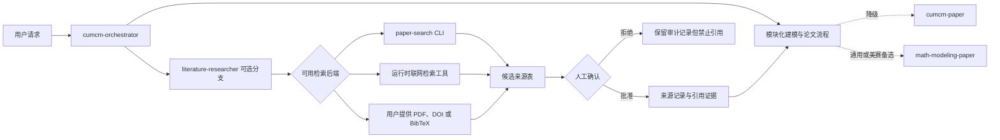

# 论文生成与文献检索 Skill 整合设计

## 文档状态

| 属性 | 内容 |
| --- | --- |
| 设计日期 | 2026-08-21 |
| 适用项目 | 国赛数学建模工作台 |
| 已选方案 | 阶段对齐整合 |
| 默认入口 | `cumcm-orchestrator` |
| 新增能力 | `literature-researcher` |
| 兼容备选 | `cumcm-paper`、`math-modeling-paper` |
| 目标运行时 | Codex 主用，DeepSeek Harness 兼容 |

本设计把已经存在的论文生成 Skill 和文献检索 Skill 纳入工作台，但不把它们物理合并成一个大 Skill。工作台继续以模块化流程为主，现有 Skill 保留为人工可选的兼容或降级入口。

## 现状与约束

本机已经存在三项个人 Skill：

| 能力 | 当前状态 | 整合定位 |
| --- | --- | --- |
| `math-modeling-paper` | 可加载；覆盖 CUMCM、MCM/ICM；没有联网检索和确定性排版工具 | 非国赛或模块化流程不可用时的通用备选 |
| `cumcm-paper` | 可加载；含 CUMCM 写作资料和 LaTeX 模板；声明依赖 `cumcm_*` 插件工具 | 国赛单 Skill 降级入口与迁移素材来源 |
| `paper-search` | Skill 可加载；依赖 `paper-search` CLI | 文献检索后端候选 |

环境探测结果：

- `paper-search` 命令当前不可用。
- `cumcm_scaffold`、`cumcm_latex_check`、`cumcm_submission_check` 当前没有注册为可调用工具。
- 三个个人 Skill 位于用户运行时目录，不属于本仓库的可发布资产，不能作为 Codex/DSH 包的隐式依赖。
- 当前总体设计禁止自动伪造、搜索并插入参考文献。本设计保留“禁止伪造和静默插入”，将允许范围收窄为“检索候选、人工确认、证据化入库、受控引用”。

## 目标与非目标

### 目标

1. 为 `cumcm-orchestrator` 增加可选文献研究分支。
2. 让检索结果先成为候选来源，而不是直接成为论文引用。
3. 让每条正式引用具备可核验元数据、访问记录、内容指纹和人工确认状态。
4. 复用现有 Skill 中经过验证的写作资料与模板，同时维持仓库内单一事实来源。
5. 为 Codex 与 DSH 提供语义一致的路由、契约、资产和失败行为。
6. 保留三个个人 Skill 的独立调用方式，作为兼容和降级选项。
7. 提供面向使用者的论文与文献工作流说明文档。

### 非目标

- 不把三个现有 Skill 原样复制到一个新目录。
- 不让论文生成器自行决定引用未经确认的候选文献。
- 不根据标题或摘要伪造 DOI、作者、年份、页码或研究结论。
- 不在本设计阶段安装 CLI、插件、TeX 发行版或修改用户个人 Skill。
- 不绕过阶段 1–7 的依赖关系提前建设完整论文生产线。
- 不把文献数量、期刊等级或引用次数直接当作模型正确性的证据。

## 架构与职责

### `cumcm-orchestrator`

- 作为国赛默认入口，判断当前阶段和是否需要文献研究。
- 文献检索不是每题强制步骤；只有背景事实、方法来源、对比基线、数据来源或引用要求需要外部证据时才启动。
- 不新增第五个全局人工门。候选文献可在模型选择阶段暂存，正式引用清单在人工门 3“确认论文提纲”时一并批准。
- 主流程不可用时，明确向用户展示 `cumcm-paper` 与 `math-modeling-paper` 备选，而不是静默切换。

### `literature-researcher`

单一职责是从研究问题生成检索计划、归一化候选来源、辅助筛选与阅读，并输出可审核的来源记录。它不写论文正文、不选择主模型、不替用户批准文献。

核心输出：

1. 检索问题与中英文关键词。
2. 数据源、年份和结果数量等检索参数。
3. 去重后的候选表：标题、作者、年份、来源、DOI/URL、摘要可用性、全文可用性。
4. 每篇候选的用途建议：背景、方法、基线、数据来源、局限或不采用。
5. 人工选择记录。
6. 已批准来源的结构化元数据、访问时间和本地内容哈希。
7. 与论文主张对应的引用位置和使用边界。

停止条件：没有可用后端、元数据冲突、来源不可访问、全文与元数据不匹配、用户未确认候选或引用主张超出来源证据。

### 现有论文 Skill

- `cumcm-paper`：保持可独立触发。工作台完整流程不可用且任务是 CUMCM 时，可由用户显式选择；其 LaTeX 模板和写作资料只在核对许可证、来源、内容差异和测试后迁入 `shared/`。
- `math-modeling-paper`：保持可独立触发。用于 MCM/ICM、其他竞赛或用户明确要求单 Skill 快速流程；不会成为 CUMCM 模块化流程的开发源。
- 两者都不得把缺失的插件、CLI 或数据描述为可用，也不得生成无来源数值或引用。

## 后端选择与降级

| 优先级 | 可观察条件 | 使用方式 | 失败处理 |
| --- | --- | --- | --- |
| 1 | `paper-search` CLI 已安装且可执行 | 使用目标来源搜索、读取或下载，归一化 JSON 输出 | 返回结构化可恢复错误并进入后端选择 |
| 2 | 当前 Codex/DSH 运行时存在获准的论文或网页检索工具 | 使用该工具检索，映射到相同来源记录 | 标记后端与查询，禁止声称来自 `paper-search` |
| 3 | 用户提供 PDF、DOI、BibTeX、RIS 或网页 | 离线读取或按标识解析，保存输入哈希 | 缺少必要元数据时请求补充，不猜测 |
| 无 | 上述条件均不满足 | 只生成检索计划和待提供清单 | 停止引用流程，论文可以继续处理不依赖文献的部分 |

安装 `paper-search` 或 `cumcm-paper` 插件属于显式环境变更，必须在对应实施阶段单独获得授权并通过安装后探测。降级是用户可见选项，不改变证据门槛。

## 文献数据与证据链

现有 `artifact` 可登记下载的 PDF、BibTeX、文本摘录或检索结果文件，但现有 `evidence-link` 强制要求实验 ID，不适合直接表达文献证据。因此在进入依赖该能力的实现阶段前，追加两个非破坏性契约：

### `literature-source`

建议前缀 `src_`，至少包含：

- `schema_version`
- `source_id`
- `title`
- `authors`
- `year`
- `venue_or_repository`
- `identifiers`：DOI、arXiv ID、PMID 等可选标识
- `canonical_url`
- `retrieved_at`
- `retrieval_backend`
- `verification_status`：`candidate`、`approved`、`rejected`
- `artifact_ids`
- `content_sha256`
- `decision_id`：批准后必需

### `citation-link`

建议前缀 `cite_`，至少包含：

- `schema_version`
- `citation_id`
- `claim_id`
- `source_id`
- `usage`：背景、方法、基线、数据、局限
- `locator`：页码、章节、图表或段落定位
- `support_boundary`
- `verified_at`

契约目录将从 9 项以向后兼容方式扩展；所有有效、无效样例、验证器计数和文档必须同步迁移。引用文本只保存核验所需的短摘录或定位，不保存无必要的大段受版权保护正文。

## 标准数据流

1. `problem-reader` 生成结构化问题清单。
2. `model-selector` 或 `paper-outliner` 标记需要外部证据的主张。
3. `literature-researcher` 生成检索式并选择可用后端。
4. 后端返回候选；系统按 DOI、规范化标题和来源标识去重。
5. 用户查看候选表，批准或拒绝；决定写入 `decision` 记录。
6. 对批准项读取全文或用户提供文件，登记 `artifact` 与 `literature-source`。
7. 为论文主张创建 `citation-link`，记录定位和支持边界。
8. `paper-writer` 只能使用 `approved` 来源；无法核验的候选不能进入参考文献。
9. `citation-check` 检查正文引用、参考文献、来源记录和定位一一对应。
10. 论文修改、新增主张或来源文件变化后，相关引用审批失效并重新核验。

## 单一事实来源与迁移

现有个人 Skill 是迁移输入，不是发布依赖。迁移按以下顺序进行：

1. 生成文件清单、哈希和能力矩阵。
2. 对比两个论文 Skill 的模型工具箱、写作规范、评审清单和模板。
3. 将无冲突且来源清楚的内容归一化到 `shared/knowledge/writing/`、`shared/templates/latex/cumcm/` 和相关规则目录。
4. 冲突内容按当前年度规则、现有 Schema 和人工决策处理；不以“文件更新”自动覆盖。
5. Codex 与 DSH Skill 从 `shared/` 打包，资产清单记录双端哈希。
6. 原个人 Skill 保持不变，直到新流程通过真题回归；之后仍可作为用户显式选择的 legacy 入口。

## 阶段落点

| 阶段 | 新增或调整内容 | 验收重点 |
| --- | --- | --- |
| Phase 0 增量 | `literature-source`、`citation-link` 契约与计数迁移 | 严格 JSON、正负样例、版本与路径安全 |
| Phase 2 | 文献检索与引用基础知识、去重和来源评价规则 | 不把引用量等同质量，能识别元数据冲突 |
| Phase 3 | Codex `literature-researcher` 与触发/降级测试 | 无后端时停止，不伪造来源 |
| Phase 4 | 引用证据、BibTeX/LaTeX 集成、`citation-check` | 正文引用与批准来源一一对应 |
| Phase 6 | `cumcm-orchestrator` 文献分支与门 3 审批 | 不新增全局门，不可绕过确认 |
| Phase 7 | DSH 同名 Skill 与检索 Tool 插件 | 资产哈希一致、真实组合、网络权限显式 |
| Phase 8 | 真题引用回归与人工来源复核 | 检索可重复、引用无伪造、降级行为一致 |

`cumcm-paper` 模板与 `math-modeling-paper` 资料的迁移可以随对应 Phase 分批完成，不阻塞 Phase 1 可复现底座。

## 错误与安全处理

- 网络不可用、限流、认证失败或来源拒绝访问时返回结构化错误，不用模型记忆补全。
- DOI、标题、作者或年份冲突时保持候选状态，等待人工核验。
- 下载内容的媒体类型、文件头或哈希不符合预期时拒绝登记为论文全文。
- 论文写作不得引用 `candidate` 或 `rejected` 来源。
- 任何后端输出都视为不可信输入，必须通过严格 JSON、路径和 URL 校验。
- API key 只存在运行时配置，不进入 Skill、仓库、日志或来源记录。
- 检索和阅读遵守来源许可；只保留工作流需要的元数据、定位和短摘录。

## 测试策略

1. **能力盘点测试**：验证三个 legacy Skill 的清单与哈希，检测内容漂移。
2. **契约测试**：覆盖来源、引用、候选/批准状态、元数据冲突和非法路径。
3. **路由测试**：CLI 可用、运行时工具可用、用户文件和无后端四种条件均得到确定选择。
4. **触发测试**：需要文献时触发 `literature-researcher`；纯数据求解或已有充分来源时不触发。
5. **负面测试**：后端失败、重复 DOI、标题冲突、PDF 不匹配、未批准来源、缺失定位均不能进入论文。
6. **证据测试**：每个正文引用都映射到批准来源和准确定位；修改后旧审批失效。
7. **双端测试**：Codex/DSH 比较语义、契约版本、资产哈希和降级选择，不要求逐字输出一致。
8. **真题回归**：由人工复核检索相关性和引用支持边界，不能只依赖 Skill 自述。

Skill 创建和修改遵循 RED–GREEN–REFACTOR：先记录没有新 Skill 时的路由、伪造或遗漏失败，再写最小指令，最后用新上下文前向测试。

## 使用说明交付

实现计划必须创建 `docs/guides/paper-and-literature-workflow.md`，至少包含：

- 默认入口与三个 legacy 备选的选择表。
- 文献分支的触发时机和人工确认点。
- Codex 与 DSH 的调用方式。
- `paper-search`、运行时检索工具和用户文件三种后端。
- 后端安装状态探测与显式安装授权说明。
- 从候选表到正式引用的示例。
- 常见失败、降级方式和恢复步骤。
- “不得伪造数据、结果和引用”的醒目警告。

该说明以真实实现和测试结果为准；尚未安装的后端必须标记为不可用，不能把规划命令写成已验证命令。

## 验收标准

- 总体设计与主计划不再把受控候选检索误写为禁止能力。
- 三个现有 Skill 的职责、状态、迁移路径和备选条件明确。
- `literature-researcher` 不承担论文写作或人工审批。
- 没有可用检索后端时，流程能停止或继续不依赖文献的工作，不生成来源。
- 未经人工确认的来源无法进入正式引用。
- 新契约、打包资产和错误行为在 Codex/DSH 两端语义一致。
- 使用说明覆盖默认、备选、降级、证据和双端操作。
- 阶段依赖保持有效，不提前实现尚未稳定的论文或 DSH 接口。
