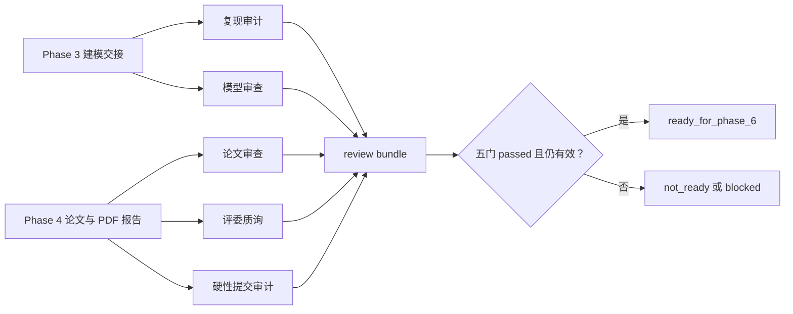

# Phase 5 五层独立审批闭环设计

**日期：** 2026-08-25
**状态：** 已实施并验证
**依赖：** Phase 3 建模交接已验证；Phase 4 论文 toolkit 核心与证据约束端到端管线已合入 `main`

## 目标

把现有 Phase 5 独立审批基础片补成可供 Phase 6 直接消费的完整闭环：五个职责隔离的 Codex 审批 Skill、五份可执行量表、模型与论文评分卡、只读审批报告、报告失效检查，以及只有全部审批仍有效时才成立的审批汇总。

完成后，工作台必须能够对同一组建模与论文产物分别给出硬性提交、复现、模型、论文和评委质询报告。审批只能发现和记录问题，不得修订被审文件；任何输入、量表或被审文件变化都必须使相关旧审批以及汇总失效。

## 范围裁决

采用五个独立入口和一个确定性汇总器：

| 质量门 | Codex Skill | 主要输入 | 主要输出 |
| --- | --- | --- | --- |
| Gate 0 硬性提交审计 | `submission-auditor` | build、lint、citation、PDF、最终文件哈希 | submission review report |
| Gate 1 复现审计 | `repro-reviewer` | 五类 Phase 3 handoff、artifact、experiment、环境记录 | reproducibility review report |
| Gate 2 模型审查 | `model-reviewer` | 模型比较、基线、验证、敏感性、模型评分卡 | model review report |
| Gate 3 论文审查 | `paper-reviewer` | 论文源文件、证据解析、引用、lint、论文评分卡 | paper review report |
| Gate 4 评委质询 | `red-team-reviewer` | 关键主张、支持边界、限制、替代解释、反例 | red-team review report |

不采用单一总审 Skill，也不让 `paper-reviewer` 代跑质询和提交门。Phase 6 只消费五份报告和确定性汇总，不调用某个“大而全”的审批入口。

## 架构



`shared/rubrics/` 仍是内部审批规则唯一来源。`cumcm_toolkit.review` 负责确定性校验、评分、哈希和汇总；Codex Skill 负责读取证据、形成有证据定位的独立判断，并调用确定性工具。Skill 不直接计算最终通过状态，也不修改论文或模型。

## 正式契约

Phase 4 已经合入，因此解除基础片为避免接口冲突而设置的临时限制，正式登记以下三个契约：

1. `modeling-handoff.schema.json`：固定 `complete|blocked` 外壳、artifact type、输入、输出、证据和恢复字段。
2. `review-report.schema.json`：从 `shared/rubrics/` 中的内部草案迁移到 `shared/contracts/`，增加可选评分卡和独立 reviewer findings。
3. `review-bundle.schema.json`：固定五门报告身份、报告哈希、整体 readiness、open S0/S1 汇总和生成时间。

契约目录从 11 项增加到 14 项。每个新契约必须有有效与无效 fixture、目录登记、元 Schema 校验、CLI 验证和迁移说明。DSH Phase 7 只消费这三项正式接口，不复制一套 DSH 专用格式。

## 审批报告

每份审批报告至少包含：

```yaml
schema_version: "1.0"
review_id: review_...
rubric_id: paper-quality
rubric_version: "1.0"
review_gate: paper
evaluated_rule_ids: []
rubric_digest: <sha256>
input_digest: <sha256>
reviewed_files: []
status: passed | failed | blocked
scorecard: null
findings: []
errors: []
reviewed_at: <RFC3339>
```

`status` 是审批裁决，不与外层 Skill 的 `complete|blocked` 执行状态混用。缺能力、缺证据、缺文件或输入不合法时为 `blocked`；存在 open S0/S1 或评分未达线时为 `failed`；其余为 `passed`。

## 评分卡

只有模型和论文两门使用评分卡。量表保存维度、内部权重、总分通过线和单维下限；Skill 提供每个维度的分数、理由和证据引用，toolkit 重新计算结果，拒绝缺维度、重复维度、越界分数、无证据分数和自行填写的总分。

统一通过条件：

- 加权总分不低于 85。
- 任一关键维度不低于 70。
- 无 open S0/S1。
- 权重总和严格等于 100。

模型评分维度沿用总体设计：问题理解与数据 15、假设与数学正确性 20、求解与可复现 15、基线与对比 10、验证与敏感性 20、创新与现实价值 20。

论文评分维度沿用总体设计：摘要 25、结构与逻辑 15、结果分析 20、图表 15、公式与符号 10、引用与原创性 10、排版与提交 5。

这些是内部质量控制权重，不表示官方评分权重。评分卡不能覆盖 S0/S1：即使总分达到 85，只要存在 open S0/S1，报告仍为 `failed`。

## 五门输入映射

### Gate 0：硬性提交审计

输入来自 Phase 4 `build_paper`、`lint_paper`、`citation_check`、`inspect_pdf` 以及最终 TeX/PDF 的 artifact 记录。必须检查构建状态、未定义引用、lint error、引用审批、PDF 可读性、空白页、字体检查结果、源文件哈希和 PDF 哈希。年度规则未核验或需要的最终文件缺失时返回 `blocked`。

### Gate 1：复现审计

输入是五类 Phase 3 handoff 及其真实 artifact、experiment 和 evidence-link 记录。除 complete 状态外，还必须检查实验状态、随机种子、输入/代码/输出 artifact 身份、环境 lock 哈希和被引用文件仍与索引哈希一致。只满足 ID 格式但记录不存在时返回 `blocked`。

### Gate 2：模型审查

检查基线、候选比较、模型假设、验证设计、指标口径、求解状态、敏感性有效点和失败边界，同时消费模型评分卡。`model-reviewer` 不再代跑复现门；两门报告彼此独立。

### Gate 3：论文审查

输入 Phase 4 的证据解析、引用检查、lint 报告、论文源文件和论文评分卡。关键数值存在 unresolved、引用来自未批准来源、正文存在阻断 lint、评分不达线或发现 S0/S1 时失败。

### Gate 4：评委质询

对每个关键 `clm_*` 主张至少形成一条覆盖记录，内容包含支持边界、适用条件、反例或压力情景、替代解释和回应结论。允许结论为“当前证据不足”，但必须形成 S0/S1 finding 或明确阻断，不能把缺证据描述成通过。确定性工具校验关键主张覆盖率、证据 ID 和字段完整性；具体质询内容由只读 Skill 产生。

## Reviewer findings

审批引擎允许 Skill 提交额外 findings，但每条必须通过 `review-finding` 契约，并满足：

- `finding_id` 在单份报告中唯一。
- evidence refs 必须解析到当前输入已有的 `clm_*`。
- reviewer finding 与量表自动 finding 使用同一 S0–S3 语义。
- Skill 不能把 finding 标记为 `resolved` 或 `accepted_risk`；此类状态只能来自带 decision ID 的后续人工处理。
- 评审不接受修订回调或写文件回调。

## 审批汇总

`build_review_bundle` 接收五份报告、各门当前输入、量表和被审文件集合，并重新执行 current 检查。输出：

```yaml
schema_version: "1.0"
bundle_id: review_bundle_...
report_ids: {}
report_digests: {}
readiness: ready_for_phase_6 | not_ready | blocked
open_blocking_findings: []
errors: []
created_at: <RFC3339>
```

判定顺序：

1. 缺任一门、报告 Schema 无效、报告不属于预期量表或无法重新核验输入时为 `blocked`。
2. 任一报告过期、`blocked`、`failed` 或包含 open S0/S1 时为 `not_ready`。
3. 只有五份报告全部 `passed`、仍为 current、报告哈希可重算且无 open S0/S1 时为 `ready_for_phase_6`。

汇总器不修改单门报告，不自动解决 findings，也不把 S2/S3 从报告中删除。

## Skill 结构

新增 `repro-reviewer`、`paper-reviewer`、`red-team-reviewer`、`submission-auditor`；保留并收窄 `model-reviewer`。每个 Skill 都包含清晰的触发/不触发边界、只读约束、缺输入停止条件、外层 handoff 和自包含资源声明。

发行 catalog 从 7 个增加到 11 个。打包器继续使用 catalog 驱动、原子输出、`references/<source path>` 布局、资源 SHA-256 和可选现有目录漂移检查。

## 失败与恢复

- 缺 Phase 4 报告或 capability：对应门 `blocked`，列出缺失项和恢复条件。
- 被审文件在评审期间变化：拒绝生成 current 报告，重新读取后再评审。
- 量表发生变化：旧报告自动过期，必须重跑该门并重建汇总。
- 论文修订：论文、质询、提交三门旧报告失效；若修改触及模型结论或数值，复现和模型门也必须重跑。
- finding 修复：修订发生在审批之外；保存新 artifact 后重新评审，不原地修改旧报告。
- 工具异常：保留结构化 errors，不输出伪造 finding 或通过状态。

## 测试策略

1. 契约测试：三个新 Schema 的正负 fixture、目录和迁移验证。
2. 评分测试：权重、总分、维度下限、缺失/重复/越界/无证据和 S0/S1 优先级。
3. 引擎测试：外部 findings 校验、只读性、文件/量表/输入变化失效。
4. 五门单独测试：每门至少一条 passed、failed、blocked 场景，且 finding 只来自本门。
5. Skill 测试：11 个 Skill 的目录、触发边界、资源、自包含打包、格式和 fail-closed。
6. 汇总测试：缺门、错量表、过期报告、单门失败、S0/S1 和完整 ready 场景。
7. E2E：使用 Phase 3 真实落盘 handoff 与 Phase 4 论文报告建立五门报告；修改论文后断言论文/质询/提交审批和 bundle 失效。
8. 全仓回归、契约验证器、Skill 打包器、`git diff --check`。

真实 XeLaTeX/PDF 路径继续由 Phase 4 E2E 覆盖；Phase 5 快速 E2E 使用已验证形状的合成报告，避免每次审批单元测试都重新编译论文。

## Phase 5 完成标准

- 五份量表均能消费真实 Phase 3/4 产物，不再因 Phase 4 capability 缺失而固定 `blocked`。
- 五个审批 Skill 职责隔离且均可自包含打包。
- 模型与论文评分卡由 toolkit 确定性重算并执行 85/70 门槛。
- 任一输入、文件或量表变化会使相关旧报告和 bundle 失效。
- 五门完整、有效、通过且无 open S0/S1 时，bundle 才为 `ready_for_phase_6`。
- 三个正式契约通过验证，目录为 14 项且零错误。
- 全量测试、Skill 校验和打包检查通过。

达到以上标准后，主计划 Phase 5 才能标记完成，并以 `review-bundle` 契约作为 Phase 6 总控状态机的稳定输入。

## 非目标

- 审批 Skill 自动修改模型、论文、代码或 PDF。
- 用内部评分权重冒充官方评分标准。
- 在 Phase 5 实现 Phase 6 的四个人工确认门或状态机。
- 在 Phase 5 实现 DSH 插件；Phase 7 通过正式契约适配。
- 用静态关键词测试冒充真实 Skill 前向行为测试。
